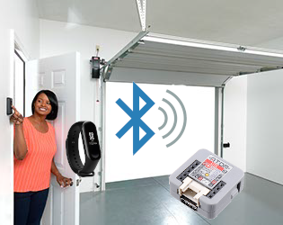

<!--
*** Thanks for checking out the Best-README-Template. If you have a suggestion
*** that would make this better, please fork the repo and create a pull request
*** or simply open an issue with the tag "enhancement".
*** Thanks again! Now go create something AMAZING! :D
***
***
***
*** To avoid retyping too much info. Do a search and replace for the following:
*** github_username, repo_name, twitter_handle, email, project_title, project_description
-->


<!-- PROJECT SHIELDS -->
<!--
*** I'm using markdown "reference style" links for readability.
*** Reference links are enclosed in brackets [ ] instead of parentheses ( ).
*** See the bottom of this document for the declaration of the reference variables
*** for contributors-url, forks-url, etc. This is an optional, concise syntax you may use.
*** https://www.markdownguide.org/basic-syntax/#reference-style-links
-->
[![Contributors][contributors-shield]][contributors-url]
[![Forks][forks-shield]][forks-url]
[![Stargazers][stars-shield]][stars-url]
[![Issues][issues-shield]][issues-url]
[![MIT License][license-shield]][license-url]
[![LinkedIn][linkedin-shield]][linkedin-url]


<!-- PROJECT LOGO -->
<br />
<p align="center">
  <a href="https://github.com/andrevilas/atom-doorkeeper-miband-mqtt">
    
  </a>

  <h3 align="center">atom-doorkeeper-miband-mqtt</h3>

  <p align="center">
    In a world dominated by the pandemic. Touching something that someone else may have recently touched can be a major risk to your health. Thinking about it, why not be able to open your garage door without touching anywhere? Or even if you forgot your keys somewhere but your Mi Band 3 or other Bluetooth device is with you. We will use them as access keys ...
    <br />
    <a href="https://github.com/andrevilas/repo_name"><strong>Explore the docs »</strong></a>
    <br />
    <br />
    <a href="https://github.com/andrevilas/atom-doorkeeper-miband-mqtt">View Demo</a>
    ·
    <a href="https://github.com/andrevilas/atom-doorkeeper-miband-mqtt">Report Bug</a>
    ·
    <a href="https://github.com/andrevilas/atom-doorkeeper-miband-mqtt">Request Feature</a>
  </p>
</p>


<!-- TABLE OF CONTENTS -->
<details open="open">
  <summary><h2 style="display: inline-block">Table of Contents</h2></summary>
  <ol>
    <li>
      <a href="#about-the-project">About The Project</a>
      <ul>
        <li><a href="#built-with">Built With</a></li>
      </ul>
    </li>
    <li>
      <a href="#getting-started">Getting Started</a>
      <ul>
        <li><a href="#prerequisites">Prerequisites</a></li>
        <li><a href="#installation">Installation</a></li>
      </ul>
    </li>
    <li><a href="#usage">Usage</a></li>
    <li><a href="#roadmap">Roadmap</a></li>
    <li><a href="#contributing">Contributing</a></li>
    <li><a href="#license">License</a></li>
    <li><a href="#contact">Contact</a></li>
    <li><a href="#acknowledgements">Acknowledgements</a></li>
  </ol>
</details>


<!-- ABOUT THE PROJECT -->
## About The Project

This sketch was created to meet a simple need: opening the garage door using my Mi Band 3. I studied several "how to's" found on Google and finally assembled this code. Several examples were analyzed and used to arrive at a functional sketch for the scenario I need. The board used was an ESP32 from M5Stack, the ATOM Lite.

### Built With

* [C]()
* [C++]()
* [Arduino IDE]()


<!-- GETTING STARTED -->
## Getting Started

To get a local copy up and running follow these simple steps.

### Prerequisites

Check https://www.arduino.cc/en/guide/ to install the Arduino IDE
Install de library for the ESP32 boards
Check https://github.com/m5stack/M5Atom and https://www.youtube.com/watch?v=2f4biAfvC_M to install M5Stack ATOM library on Arduino IDE
Install the following libraries too: BLE (https://www.arduino.cc/reference/en/libraries/esp32-ble-arduino/), PubSubClient (https://www.arduino.cc/reference/en/libraries/pubsubclient/)
  ```

### Installation

1. Clone the repo
   git clone https://github.com/andrevilas/atom-doorkeeper-miband-mqtt.git
   ```
2. Open the .ino file on Arduino IDE
   ```   
3. Make your changes
   ```
4. Burn the code on the ESP32 board and go happy
   ```

<!-- USAGE EXAMPLES -->
## Usage

In a pandemic season, avoid touching places that more than one person usually touches. So why not use BLE technology to trigger without touching. Or just if you forgot your keys but still have the Mi Band 3 on your wrist ...

<!-- ROADMAP -->
## Roadmap

See the [open issues](https://github.com/github_username/repo_name/issues) for a list of proposed features (and known issues).


<!-- CONTRIBUTING -->
## Contributing

Contributions are what make the open source community such an amazing place to be learn, inspire, and create. Any contributions you make are **greatly appreciated**.

1. Fork the Project
2. Create your Feature Branch (`git checkout -b feature/AmazingFeature`)
3. Commit your Changes (`git commit -m 'Add some AmazingFeature'`)
4. Push to the Branch (`git push origin feature/AmazingFeature`)
5. Open a Pull Request


<!-- LICENSE -->
## License

Distributed under the MIT License. See `LICENSE` for more information.


<!-- CONTACT -->
## Contact

André Vilas Boas Fagundes - [@twitter_handle](https://twitter.com/andrevilas) - email

Project Link: [https://github.com/andrevilas/atom-doorkeeper-miband-mqtt](https://github.com/andrevilas/atom-doorkeeper-miband-mqtt)


<!-- ACKNOWLEDGEMENTS -->
## Acknowledgements

Thanks for the https://github.com/othneildrew/Best-README-Template 


<!-- MARKDOWN LINKS & IMAGES -->
<!-- https://www.markdownguide.org/basic-syntax/#reference-style-links -->
[contributors-shield]: https://img.shields.io/github/contributors/github_username/repo.svg?style=for-the-badge
[contributors-url]: https://github.com/andrevilas/atom-doorkeeper-miband-mqtt/graphs/contributors
[forks-shield]: https://img.shields.io/github/forks/github_username/repo.svg?style=for-the-badge
[forks-url]: https://github.com/andrevilas/atom-doorkeeper-miband-mqtt/network/members
[stars-shield]: https://img.shields.io/github/stars/github_username/repo.svg?style=for-the-badge
[stars-url]: https://github.com/andrevilas/atom-doorkeeper-miband-mqtt/stargazers
[issues-shield]: https://img.shields.io/github/issues/github_username/repo.svg?style=for-the-badge
[issues-url]: https://github.com/andrevilas/atom-doorkeeper-miband-mqtt/issues
[license-shield]: https://img.shields.io/github/license/github_username/repo.svg?style=for-the-badge
[license-url]: https://github.com/git/git-scm.com/blob/master/MIT-LICENSE.txt
[linkedin-shield]: https://img.shields.io/badge/-LinkedIn-black.svg?style=for-the-badge&logo=linkedin&colorB=555
[linkedin-url]: https://www.linkedin.com/in/andr%C3%A9-vilas-boas-fagundes-282635a/
